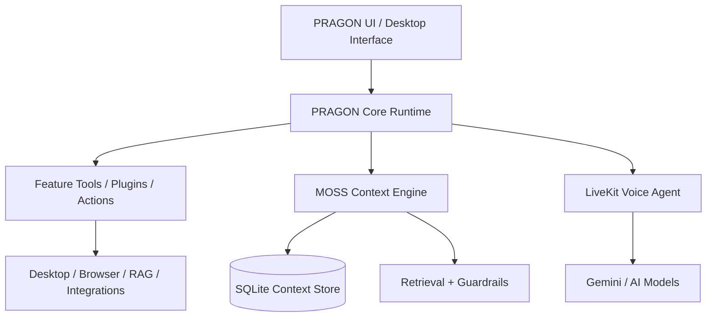

[COPILOT ARCHITECTURE.pdf](https://github.com/user-attachments/files/32413875/COPILOT.ARCHITECTURE.pdf) <--CLICK THIS TO VIEW HI DEVS COPILOT ARCHITECTURE

#  PRAGON 
> A complete, local-first AI assistant and automation platform combining the PRAGON runtime with the MOSS memory and retrieval layer,
PRAGON is a comprehensive operating layer for an AI assistant. It provides conversational capabilities, persistent memory, visual agent building, real-time voice interaction, offline RAG-augmented reasoning with "N8N CONNECTIVITY AND ALSO PAID MODEL CONNECTIVITY"

simply: PRAGON agent that understands and responds instantly for field workers, healthcare, dispatch, customer support, and more. with Moss for sub-10ms context retrieval, real-time knowledge access, and low-latency agent interactions.  

## PRAGON — 4W

* **What:** PRAGON solves the problem of **multiple disconnected AI tools and slow manual workflows** by combining AI understanding, planning, context retrieval, tool usage, and task execution into one AI Agent system. **Moss** provides **sub-10ms context retrieval** for fast, relevant knowledge access.

* **Why:** To make AI interactions **faster, context-aware, and autonomous**, reducing repeated manual work.

* **Who:** **Developers, students, creators, businesses, field workers, healthcare, dispatch, and customer-support teams**.

* **How:**
  **Next.js** → Frontend/UI
  **Python + FastAPI** → Backend and API layer
  **LiveKit** → Real-time voice/audio communication
  **Moss** → Sub-10ms context retrieval
  **AI Agent** → Understands, plans, uses tools, and executes tasks

  **Flow:** User Input → LiveKit/Next.js → FastAPI/Python → Moss retrieves context → PRAGON Agent processes → Tools execute → Result.

---

##  Architecture at a Glance



---

###  Core Subsystems

This repository integrates several powerful standalone and interconnected systems:

####  MOSS Memory System
The MOSS layer adds session-aware context and grounding without replacing the original PRAGON behavior. 
- **Persistent Context**: Stores session-level context to SQLite.
- **RAG & Fallbacks**: Uses `sentence-transformers` for embeddings, falling back gracefully if offline.
- **Guardrails**: Policy checks run before risky actions (`warn` or `enforce` modes).
*See [`MOSS_INTEGRATION.md`](file:///D:/pragon_new/MOSS_INTEGRATION.md) for deeper details.*

###  LiveKit Voice Agent
A real-time voice pipeline injecting MOSS context into spoken input. 
- **Low Latency**: Fast retrieval budget (default 0.35s).
- **Seamless Bridging**: Connects into the UI via room tokens.
*See [`LIVEKIT_MOSS.md`](file:///D:/pragon_new/LIVEKIT_MOSS.md) for setup and flow.*

#####  Custom Forge & Agent Builder
A visual drawing-pad and node-based workflow builder located in `customforge/`.
- **Custom Forge**: Sketch a layout, write a brief, and generate a full single-file app (HTML/JS/CSS) live. Falls back across Gemini → Groq → local Ollama.
- **Agent Builder**: A visual canvas for wiring up autonomous tool/agent nodes (ReAct pattern). Completely Ollama-first, with Gemini backup. Runs independently on port `5057`.
*See [`customforge/README.md`](file:///D:/pragon_new/customforge/README.md) and [`customforge/agent_builder/README.md`](file:///D:/pragon_new/customforge/agent_builder/README.md).*

###### Pragon Knowledge Base (RAG System)
A standalone, offline Retrieval-Augmented Generation (RAG) service.
- **Fully Offline**: Powered by local ChromaDB and `sentence-transformers`.
- **Ollama Integration**: Optionally generates answers locally.
*See [`ragsystem/README.md`](file:///D:/pragon_new/ragsystem/README.md).*

---
# Product Requirements Document (PRD): P.R.A.G.O.N + MOSS

**Version:** 1.1  
**Status:** Production-Ready / YC Fall 2026 x Moss Sprint  
**Role:** Principal Systems Architect & Product Manager  

---

## 1. Executive Summary
**P.R.A.G.O.N (Personalized Real-time Agentic Global Operating Network) + MOSS (Modular Operating Smart System)** is a production-grade, local-first AI Operating System designed for high-stakes, real-time environments such as Emergency Dispatch, Healthcare, and Field Engineering. The system provides a "Jarvis-like" experience, combining ultra-low-latency voice interactions (LiveKit + Gemini 3.5 Flash) with sub-10ms context retrieval (MOSS). It prioritizes data privacy, offline resilience, and safety-critical execution.

## 2. Problem Statement
Field workers, dispatchers, and healthcare professionals operate in environments where every millisecond counts. Existing AI solutions suffer from:
*   **High Latency:** Cloud-based LLMs and standard RAG pipelines are too slow for natural conversation.
*   **Cloud Dependency:** Lack of offline functionality makes tools useless in remote or secure areas.
*   **Context Fragmentation:** AI often forgets immediate context or lacks access to local technical manuals.
*   **Safety Risks:** Unvalidated AI actions can lead to system corruption or incorrect data entry.

## 3. Goals & Objectives
*   **Zero-Latency Interaction:** Achieve sub-500ms end-to-end voice latency and sub-10ms context retrieval.
*   **Local-First Sovereignty:** Ensure the system remains functional offline with local LLM (Ollama) fallbacks.
*   **Enterprise Hardening:** Resolve shared-database anti-patterns and implement robust JWT/TLS security.
*   **Proactive Assistance:** Move from reactive chat to proactive "Zen Mode" and "Master Control" operations.

## 4. Target Users / Stakeholders
*   **Emergency Dispatchers:** Instant retrieval of protocols and real-time transcription.
*   **Healthcare Workers:** Hands-free patient record access and automated charting.
*   **Field Engineers:** Real-time technical manual queries and navigation in low-network areas.
*   **Admins/Company Managers:** Using "Custom Forge" to build specific agent workflows.

## 5. Functional Requirements (FR)

| ID | Requirement | Description | Component |
|:---|:---|:---|:---|
| **FR-01** | **Real-time Voice** | Sub-500ms voice-to-voice loop using WebRTC. | LiveKit + Gemini 1.5 Flash |
| **FR-02** | **Persistent Memory** | Long-term storage of user preferences and history. | Persistence Service + SQLite |
| **FR-03** | **Sub-10ms Retrieval** | Instant context injection for active conversations. | MOSS Context Engine |
| **FR-04** | **Offline Fallback** | Automatic switch to local inference when internet is lost. | Ollama (Llama 3.1) |
| **FR-05** | **Resource Balancing** | Dynamic CPU/Network throttling to prevent OS hangs. | CPU & Network Balancer |
| **FR-06** | **Safe Code Execution** | Execution of generated scripts in an isolated container. | Code Sandbox (gVisor) |
| **FR-07** | **WhatsApp Bridge** | Remote control and notifications via WhatsApp. | WhatsApp Node Bridge |
| **FR-08** | **Deep Observability** | End-to-end tracing of every agentic "thought" and tool call. | OTel Tracing Service |
| **FR-09** | **Visual Workflows** | Drag-and-drop agent logic builder. | Custom Forge |
| **FR-10** | **Phone Sync** | QR-based pairing for notification and clipboard sync. | Phone Companion |
| **FR-11** | **RAG Intelligence** | Local document ingestion (PDF/Docx) with vector search. | RAG System + ChromaDB |
| **FR-12** | **Maps & Navigation** | Real-time routing and location-aware assistance. | Navigation Service |
| **FR-13** | **Proactive Briefs** | Automated "Morning Briefs" and "Nightly Recaps." | Scheduler Service |

## 6. Non-Functional Requirements (NFR)
*   **Performance:** MOSS retrieval must be < 10ms. Voice TTFT (Time to First Token) must be < 400ms.
*   **Security:** No direct service access to DB files. All API calls must be JWT-authenticated. TLS 1.3 for LAN.
*   **Reliability:** 99.9% uptime for local services; graceful degradation to Ollama.
*   **Scalability:** Support for up to 50 concurrent local tool executions via the Resource Balancer.
*   **Usability:** Cinematic UI must maintain 60fps even during heavy inference.

## 7. System Architecture Overview
The system is organized into six logical layers:
1.  **UI/Client Layer:** Next.js for the shell; Vanilla JS for the high-performance audio "hot path."
2.  **Security & Gateway:** Auth Service (JWT) and Resource Balancer (psutil) protecting the core.
3.  **Intelligence Layer:** Orchestrator (LangGraph) managing Gemini (Cloud) and Ollama (Local).
4.  **Memory & Data Layer:** Persistence Service acting as the gatekeeper for SQLite and ChromaDB.
5.  **Comms & Tools:** LiveKit for voice, WhatsApp for messaging, and Maps for navigation.
6.  **Safety & Ops:** Code Sandbox for isolation and OTel for tracing.

## 8. Tech Stack
*   **Frontend:** Next.js, React, Tailwind CSS, Vanilla JS (Web Audio API).
*   **Backend:** Python 3.11+, FastAPI, LangGraph, gRPC.
*   **AI/ML:** Gemini 3.5 Flash, Ollama (Llama 3.1), Moss SDK, sentence-transformers.
*   **Databases:** SQLite (Timeline), ChromaDB (Vector), Redis (Caching/State).
*   **Infrastructure:** LiveKit (WebRTC), Docker (Sandbox), HashiCorp Vault (Secrets).
*   **Observability:** OpenTelemetry, Jaeger, LangSmith, Prometheus.

## 9. Data Requirements
*   **Persistence Boundary:** All data access is mediated by the **Persistence Service**. Direct file-system access to `.db` or vector folders by application services is strictly prohibited.
*   **Timeline DB (SQLite):** Stores conversation logs, scheduler tasks, and user personas.
*   **Vector Store (ChromaDB):** Stores embedded document chunks and semantic memory.
*   **Backup:** The Backup Manager triggers snapshots via the Persistence Service API to ensure zero-corruption recovery.

## 10. API Specifications (Key Endpoints)
*   **Auth:** `POST /auth/login` (Returns JWT), `GET /auth/verify`.
*   **Orchestrator:** `POST /v1/execute` (Streamed response), `POST /v1/voice/signal`.
*   **Persistence:** `GET /data/context` (MOSS optimized), `POST /data/vector/search`.
*   **Resource:** `GET /system/health` (Returns psutil metrics).

## 11. Security Requirements
*   **Authentication:** JWT-based service identity.
*   **Authorization:** Role-Based Access Control (RBAC) for tool execution (e.g., `tool:filesystem:write`).
*   **Input Validation:** Strict Pydantic schema enforcement on all FastAPI routes to prevent injection.
*   **Transport:** TLS 1.3 enforced for all non-localhost traffic (Phone Companion to Desktop).
*   **Isolation:** Code Sandbox uses gVisor to prevent container escape during tool execution.

## 12. Deployment & Infrastructure
*   **Local-First:** Designed to run on high-end workstations (Mac M-series or NVIDIA RTX).
*   **Containerization:** Docker used for the Code Sandbox and OTel backend.
*   **CI/CD:** Automated "Promptfoo" evaluations for prompt versioning before deployment.

## 13. Success Metrics
*   **Response Fluidity:** User perceived lag < 300ms in 95% of voice interactions.
*   **Context Accuracy:** MOSS retrieval relevance score > 90%.
*   **System Stability:** Zero UI freezes during 100% CPU load (managed by Balancer).
*   **Privacy:** 0% of sensitive local data leaked to cloud providers (verified by WAF/Proxy).

## 14. Timeline & Milestones
*   **Phase 1 (Core):** Persistence Service implementation and DB isolation.
*   **Phase 2 (Voice):** LiveKit + Gemini 3.5 Flash integration with Vanilla JS audio path.
*   **Phase 3 (Tools):** Maps, WhatsApp, and Custom Forge module integration.
*   **Phase 4 (Hardening):** OTel tracing, JWT security, and YC submission prep.

## 15. Open Questions & Risks
*   **Hardware Variance:** Performance on mid-range laptops vs. dedicated workstations.
*   **gRPC Overhead:** Monitoring if gRPC adds jitter to the sub-10ms MOSS target on Windows systems.
*   **Offline Parity:** Ensuring the transition from Gemini to Ollama is seamless for the user.


#######7 Repository Structure

```text
.
├── api/                          # API config and secrets
├── assets/                      # static UI assets
├── communication/               # communication and voice helper modules
├── consciousness/               # long-term memory and retrieval helpers
├── customforge/                 # custom forge app and builder code
├── extras/                      # diagnostics and helper scripts
├── features/                    # app features and agent tools
├── integrations/                # external integration hooks
├── linux/                       # Linux integration assets
├── plugins/                     # PRAGON plugins and MOSS plugin scripts
├── pragon_brain/                # memory and local knowledge helpers
├── pragon_moss/                 # MOSS integration layer
├── pragon_phoneview/            # phone / view integration
├── pragon_whatsapp/             # WhatsApp-related module
├── pragoncore/                  # core runtime utilities and protocol
├── ragsystem/                   # retrieval and knowledge system
├── vendor/                      # vendored frontend libraries
├── customforge_launcher.py      # custom forge launcher
├── livekit_agent.py             # standard LiveKit agent implementation
├── livekit_agent_moss.py        # MOSS-aware LiveKit voice agent
├── livekit_client.py            # LiveKit client logic
├── moss.py                      # standalone MOSS context engine
├── pragon_main.py               # main PRAGON runtime entrypoint
├── pragon_ui.py                 # core UI layer
├── run_pragon_moss.py           # launcher for PRAGON + MOSS
├── start_livekit_moss.py        # LiveKit startup wrapper
├── requirements.txt             # Python dependencies
├── MOSS_INTEGRATION.md          # MOSS integration notes
├── LIVEKIT_MOSS.md              # LiveKit + MOSS docs
├── .gitignore                   # ignore rules
├── README.md                    # project documentation
└── ...
```

---

##  Quick Start

### 1. Prerequisites
- **Python 3.10+** and `pip`
- (Optional but recommended) [Ollama](https://ollama.com) running locally for free unlimited fallbacks.

### 2. Install Dependencies
```bash
pip install -r requirements.txt
```
*(Note: `ragsystem` and `agent_builder` have their own isolated `requirements.txt` files for advanced features).*

### 3. Configure API Keys
Copy the example configuration:
```bash
cp api/api_keys.json.example api/api_keys.json
```
Edit `api/api_keys.json` with your credentials (e.g., Gemini API Key, LiveKit credentials). 

### 4. Run the Platform

**Start the primary assistant with MOSS enabled:**
```bash
python run_pragon_moss.py
```

**Start the Custom Forge & Agent Builder:**
```bash
cd customforge
python main.py
```
*(Opens the Forge UI at `http://127.0.0.1:5000` and Agent Builder at `http://127.0.0.1:5057`)*

**Start the LiveKit Voice Agent:**
```bash
python start_livekit_moss.py
```

---

##  Environment Configuration

Common environment variables to control behavior:
- `PRAGON_MOSS=1` (Toggle MOSS integration)
- `PRAGON_MOSS_GUARDRAIL=warn` (Safety mode: `off` / `warn` / `enforce`)
- `PRAGON_MOSS_DB=pragon_moss.db` (Database location)
- `PRAGON_MOSS_RAG=1` (Append MOSS hits to RAG queries)

---

##  Documentation Index
For deep dives into specific modules, consult the component readmes:
- [MOSS Integration Guide](file:///D:/pragon_new/MOSS_INTEGRATION.md)
- [LiveKit Voice Integration](file:///D:/pragon_new/LIVEKIT_MOSS.md)
- [Custom Forge Documentation](file:///D:/pragon_new/customforge/README.md)
- [Agent Builder Documentation](file:///D:/pragon_new/customforge/agent_builder/README.md)
- [RAG System Documentation](file:///D:/pragon_new/ragsystem/README.md)
